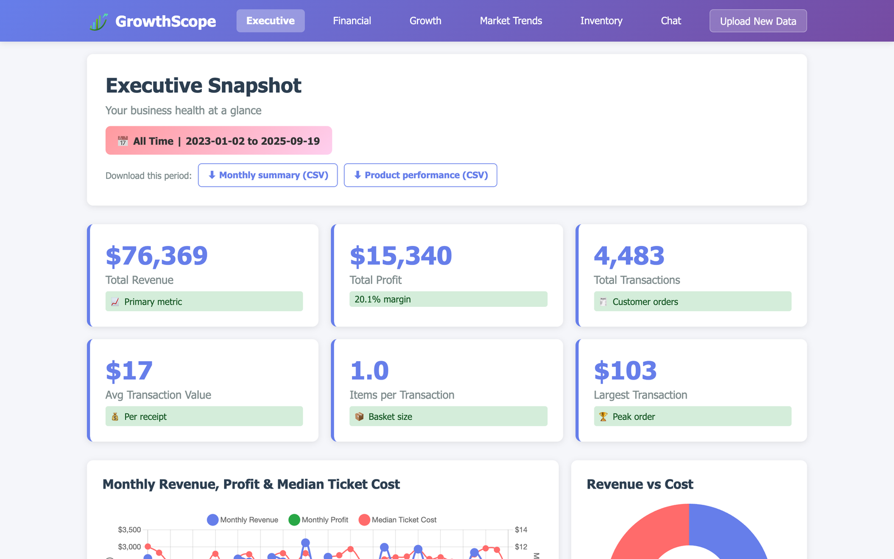
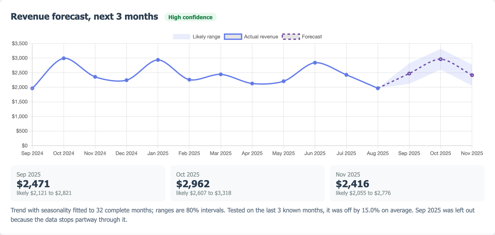
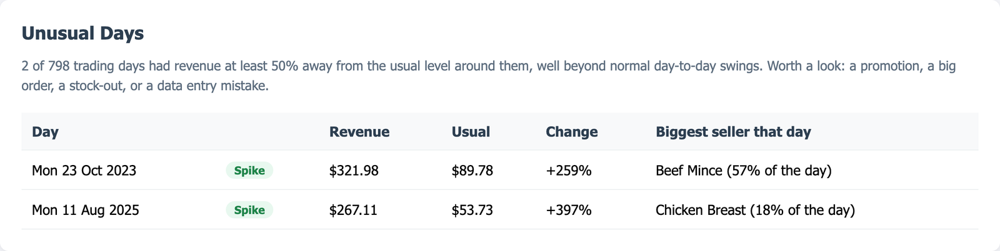
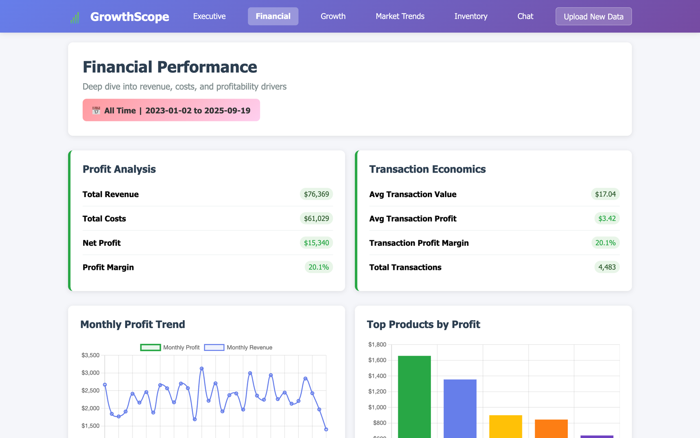
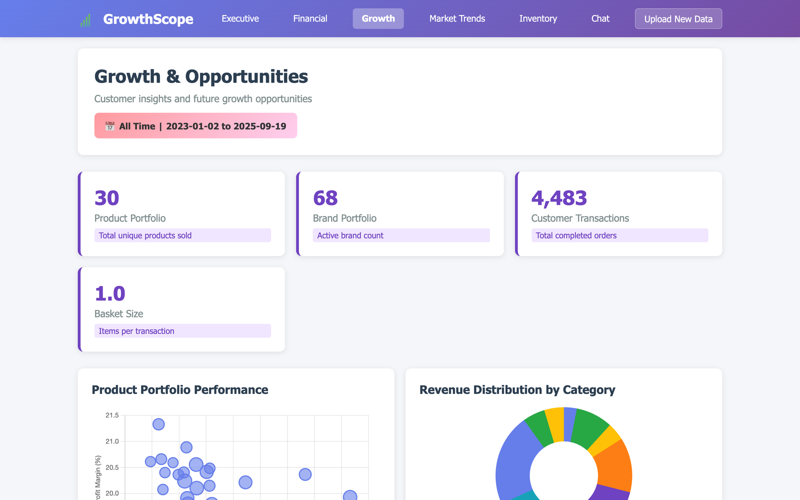
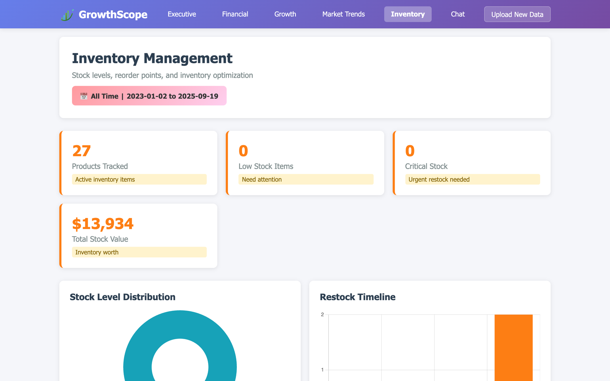
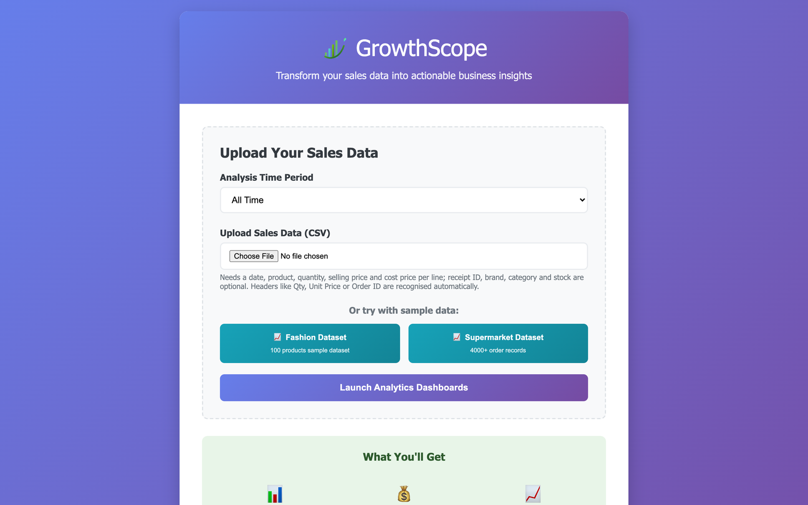

# GrowthScope

**Sales analytics for Australian small businesses: upload a CSV, get dashboards, a forecast, and plain-English answers.**

[](https://github.com/Mayukh-D/GrowthScope/actions/workflows/tests.yml)




## A note before you read the code

GrowthScope is my first vibe-coded app, built at my first hackathon: the ANU Entrepreneurship Club Hackathon in September 2025, over one weekend, with a team of four.

I came to computing through Automobile Engineering, and this was the first time I tried what people were starting to call vibe coding. We started in Replit, leaned on Claude and Gemini for almost everything, and I remember being genuinely surprised at how far a few people with AI tools could get in 48 hours: a working product, in a weekend.

It is also very much a first project. The hackathon version kept everything in one 1,300-line file, had no tests, shipped with an API key in the source, and quietly dropped more than half the rows of its own demo data. I have left that history intact on purpose. **I keep this repository as my benchmark: the place I started, so I can measure everything after it against it.**

In October 2026 I came back to it with the habits I have built since: tests, a check that has to pass before anything is pushed, honest numbers, and fixing what the hackathon version got wrong. The [changelog below](#what-changed-since-the-hackathon) lists what that turned up.

## What it does

Upload a sales export (or try a sample dataset) and GrowthScope analyses it across six dashboards.

| | |
|---|---|
| **Executive snapshot** | Revenue, profit, margin, transactions and basket size, with monthly trends and a three-month forecast |
| **Financial** | Profit and cost breakdown, transaction economics, unusual trading days, and brand and product rankings |
| **Growth** | Product portfolio performance, revenue by category, and the products worth focusing on |
| **Inventory** | Days of cover for each product and when to reorder, from the actual rate of sale |
| **AI chat** | Questions about your own data in plain English, answered by Google Gemini (optional) |
| **Market trends** | A sketch of a regional market view, using illustrative sample figures |

### Revenue forecast that tells you how wrong it has been



A trend line (with month-of-year seasonality once there are two years of data) projects the next three months with 80% ranges. Before showing anything, the model is refitted without the last three known months and scored on them, and the dashboard reports that error and a confidence level. When sales are too irregular to forecast, it says so instead of drawing a confident line. A month the data only partly covers is left out, so a file that ends on the 10th does not look like a crash.

### Unusual days, and what drove them



Each trading day is compared with the usual level around it. A day is flagged only when it is statistically extreme (a modified z-score above 3.5) and at least 50% away from normal, which matters for a shop. On 200 series of ordinary random sales this raises no false alarms, and it catches every 2.6× spike.

### Bring your own export

Headers do not have to match a template. `Transaction Date`, `Order ID`, `Item`, `Qty`, `Unit Price` and `Unit Cost` from a Square or Excel export all map automatically, prices like `$1,299.00` are read as numbers, and Australian day-first dates (`02/01/2023` is 2 January) are read correctly. The dashboard tells you what it matched and how many rows, if any, it had to skip.

### Reports

Download the selected period as CSV: a monthly summary with the forecast months appended, and every product ranked by revenue with profit, margin and share.

<table>
  <tr>
    <td width="50%"></td>
    <td width="50%"></td>
  </tr>
  <tr>
    <td width="50%"></td>
    <td width="50%"></td>
  </tr>
</table>

## What changed since the hackathon

Everything below was found by testing the app properly or looking at every page, then fixed with a test so it stays fixed.

**Bugs the hackathon version had**
- **It analysed only 41% of its own demo data.** Australian dates like `25/01/2023` failed to parse as month-first and were silently dropped; 1,840 of 4,483 supermarket rows were used, and those landed in the wrong months.
- **An API key was hard-coded in the source** (now scrubbed from this history), and the session secret defaulted to a public string.
- **Any signed-in visitor could overwrite the login page** through a leftover `/create-login-template` route. Debug routes exposed session data, and Flask's interactive debugger was on.
- **The login page would redirect to any website** given in its `next` parameter.
- **Tables were alphabetical, not ranked.** The "top products" table showed Apples ($897) and skipped bigger sellers, and the financial page listed all 68 brands.
- **"Average Order Value" was the average price per item** ($6 instead of $17.04), the chat overview said 0 products, and money had no thousands separators.
- **Every inventory item was told to restock in exactly 30 days**, counted from today rather than from the data, and "High" stock was coloured alarm red.
- **The chat page had no menu on phones**, and "Upload New Data" went back to the login form.

**New**
- The revenue forecast, unusual-day detection, flexible column mapping and CSV reports described above.
- 53 tests, and a check (`scripts/check.sh`) that lints, tests, scans for committed secrets and boots the app. It runs before every push and in CI.

## Team

Built at the **ANU Entrepreneurship Club Hackathon 2025** by Punyashree Venkatram, Rahul Sharma, Tanisha Sharma and Mayukh Das.

- **Mayukh Das and Tanisha Sharma** pair-programmed most of the original app together: the Flask backend and analytics, the dashboards, the Gemini assistant, and the login, upload and mobile UI.
- **Punyashree Venkatram** built the initial Replit prototype it grew from.

> Commit authorship in the 2025 history does not reflect who wrote what: we coded together on shared laptops and pushed from whichever account was signed in. The October 2026 revisit is mine. This repository is maintained by [Mayukh Das](https://github.com/Mayukh-D).

## Run it

```bash
git clone https://github.com/Mayukh-D/GrowthScope.git
cd GrowthScope
python3 -m venv .venv && source .venv/bin/activate
pip install -r requirements.txt
python main.py
```

Open http://localhost:5001, sign in with any username and password (it is a demo login), then upload a CSV or pick a sample dataset.

The AI chat needs a Google Gemini key; everything else works without one. See [`.env.example`](.env.example):

```bash
export GEMINI_API_KEY="your key from https://aistudio.google.com/apikey"
export SESSION_SECRET="$(python3 -c 'import secrets; print(secrets.token_hex(32))')"
```

### Deploy

The repository includes a [Render](https://render.com) blueprint ([`render.yaml`](render.yaml)): in Render choose **New → Blueprint**, pick this repository, and it builds and runs the app under gunicorn with a health check at `/healthz`. Render generates `SESSION_SECRET`; add `GEMINI_API_KEY` only if you want the AI chat. On the free plan the app sleeps when idle, so the first visit takes up to a minute.

Any host works the same way: `gunicorn main:app --workers 2 --bind 0.0.0.0:$PORT`, with `SESSION_SECRET` set to a fixed random value. Without it each worker signs sessions differently and people get logged out between requests.

### Data format

One row per line item. Required: a **date**, **product**, **quantity**, **selling price** and **cost price**. Optional: **receipt ID** (unlocks per-order metrics), **brand**, **category**, and **stock on hand** (enables the inventory page). Common header variants are recognised; the canonical names are:

```csv
Date,Receipt_ID,Product_Name,Brand_Name,Category,Quantity,Selling_Price,Cost_Price,Stock_For_Month
2024-01-15,RCP001,Wireless Headphones,TechBrand,Electronics,2,149.99,89.99,45
```

## Develop

```bash
pip install -r requirements-dev.txt
scripts/install-hooks.sh   # run the checks before every git push
scripts/check.sh           # lint, tests, secret scan, boot check
```

`scripts/screenshots.py` renders these screenshots from a live local server with Playwright and your installed Chrome (`--full` for whole pages, `--mobile` for a phone viewport). New analytics live in `analytics.py` as plain functions, so they can be tested without a running app.

## Known limits

- **The login is a demo.** Any username and password works; there are no accounts.
- **Market Trends uses fixed sample figures**, and the page says so.
- **Uploaded files live on the server's disk** for the session; it is not built for many users at once.
- **The forecast is deliberately simple.** It is a trend and seasonality model, and it reports its own error so you can judge it.

## Acknowledgments

The ANU Entrepreneurship Club for running the hackathon and the brief that started this: *"What practical, SaaS-ready tools for Australian MSMEs can you build using low-code, no-code and generative AI?"* And Replit, Claude and Gemini, which made it possible for a first-time hackathon team to build it in a weekend.
